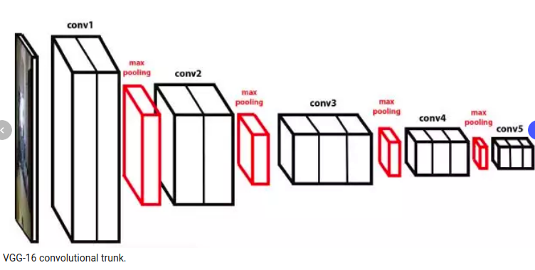
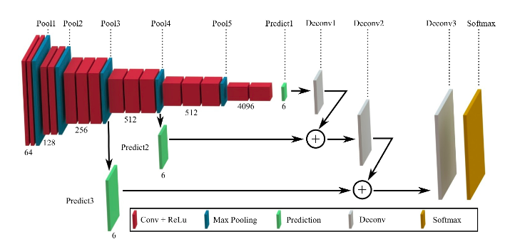
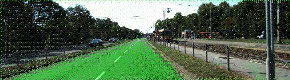
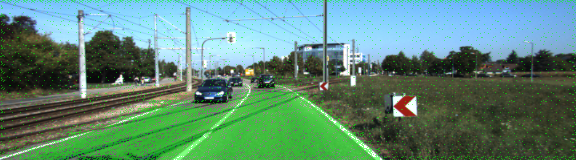
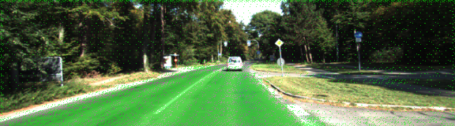
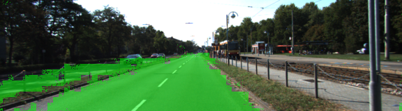
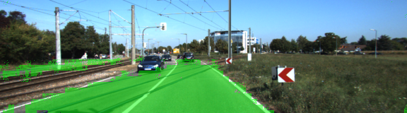
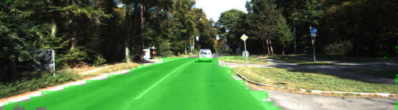

# Semantic Segmentation
### Introduction
In this project, you'll label the pixels of a road in images using a Fully Convolutional Network (FCN).

We used pre-trained VGG16 network as below diagram.




We loaded the pre-trained VGG16 and get the layer 3, layer 4, and layer 7 for FCN.


    graph = tf.get_default_graph()
    tf.saved_model.loader.load(sess,[vgg_tag],vgg_path)
    i1 = graph.get_tensor_by_name(vgg_input_tensor_name)
    k1 = graph.get_tensor_by_name(vgg_keep_prob_tensor_name)
    l3 = graph.get_tensor_by_name(vgg_layer3_out_tensor_name)
    l4 = graph.get_tensor_by_name(vgg_layer4_out_tensor_name)
    l7 = graph.get_tensor_by_name(vgg_layer7_out_tensor_name)




For FCN, We convt the VGG layer 7 and deconv it with a 2x2 kernel into Deconv1.

    conv_1x1_vgg7 = tf.layers.conv2d(vgg_layer7_out, num_classes, 1 , padding = 'same',
			kernel_regularizer=tf.contrib.layers.l2_regularizer(1e-3))
    deconv_2x2_1 = tf.layers.conv2d_transpose(conv_1x1_vgg7, num_classes, 4, 2 , padding = 'same',
                        kernel_regularizer=tf.contrib.layers.l2_regularizer(1e-3))
                        
Then we convt the VGG layer 4, and add up this conv layer with Deconv1 into a skip_layer_1 .                       
                        
    conv_1x1_vgg4 = tf.layers.conv2d(vgg_layer4_out, num_classes, 1 , padding = 'same',
			kernel_regularizer=tf.contrib.layers.l2_regularizer(1e-3))
    skip_layer_1 = tf.add(deconv_2x2_1,conv_1x1_vgg4)
 
 We deconv the skip_layer_1 with a 2x2 kernel as Deconv2.
    
    deconv_2x2_2 = tf.layers.conv2d_transpose(skip_layer_1 , num_classes, 4, 2 , padding = 'same',
                        kernel_regularizer=tf.contrib.layers.l2_regularizer(1e-3))
                        
we convt the VGG layer 3, and add up this conv layer with Deconv2 into a skip_layer_2 .                           
                        
    conv_1x1_vgg3 = tf.layers.conv2d(vgg_layer3_out, num_classes, 1 , padding = 'same',
			kernel_regularizer=tf.contrib.layers.l2_regularizer(1e-3))
    skip_layer_2 = tf.add(deconv_2x2_2,conv_1x1_vgg3)
  
Finally, We deconv the skip_layer_2 with a 8x8 kernel as Deconv3.
  
    deconv_8x8_3 = tf.layers.conv2d_transpose(skip_layer_2, num_classes, 16, 8 , padding = 'same',
                        kernel_regularizer=tf.contrib.layers.l2_regularizer(1e-3))


We "adaptive moment estimation" to optimize the network.

### Results







If I remove the skip layer and only use vgg layer 7 as the input of deconv layers.
the results became like below diagram.







##### GPU
`main.py` will check to make sure you are using GPU - if you don't have a GPU on your system, you can use AWS or another cloud computing platform.
##### Frameworks and Packages
Make sure you have the following is installed:
 - [Python 3](https://www.python.org/)
 - [TensorFlow](https://www.tensorflow.org/)
 - [NumPy](http://www.numpy.org/)
 - [SciPy](https://www.scipy.org/)
##### Dataset
Download the [Kitti Road dataset](http://www.cvlibs.net/datasets/kitti/eval_road.php) from [here](http://www.cvlibs.net/download.php?file=data_road.zip).  Extract the dataset in the `data` folder.  This will create the folder `data_road` with all the training a test images.

### Start

##### Run
Run the following command to run the project:
```
python main.py
```


